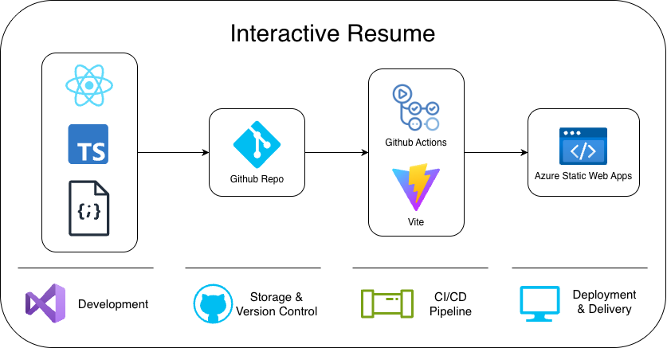
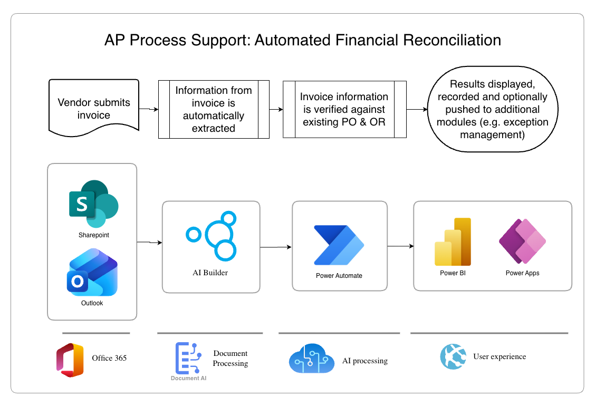

# Adrian Peh — Interactive Resume

Repository for my interactive resume site, built with React + TypeScript and deployed via Azure Static Web Apps.

**Website:** https://www.adrianpeh.works  
**LinkedIn:** https://www.linkedin.com/in/adrian-peh

---

## Table of Contents
- [Projects](#projects)
  - [Interactive Resume Diagram](#interactive-resume-diagram)
  - [Sample Process Automation Project](#sample-process-automation-project)
- [Resume](#resume)
  - [Summary](#summary)
  - [Skills](#skills)
  - [Certifications](#certifications)
  - [Professional Experience](#professional-experience)
  - [Education](#education)

---

## Projects

### Interactive Resume Diagram

  

**Stack:** Visual Studio Code, GitHub Actions, Azure Static Web Apps  
**Language:** React, TypeScript

### Sample Process Automation Project

  

---

## Resume

### Summary

Experienced in client-facing operations and automation solutions across multiple industries. Skilled in Business Process Digitalization, Optimization, and Automation, with hands-on expertise in RPA, Power Platform, and end-to-end delivery from discovery through UAT and enablement.

### Skills

- **Project Management:** Project Delivery, Client Relations, Documentation, Agile
- **Solution Architecture:** Business Process Analysis, Stakeholder Management, PoC, User Training
- **AI Automation:** Power Platform, RPA, Copilot Studio
- **Software Engineering & Development:** C++, Python, TypeScript, HTML/CSS, JavaScript, AutoCAD, UAT, Quality Assurance

### Certifications

- Understanding Cisco Network Automation Essentials (DEVNAE) — Cisco
- Six Sigma Yellow Belt Certified Professional
- Google Project Management Professional
- Configure Atlassian Tools for Effective Service Management — Atlassian (Confluence & Jira Automation)
- Registered Scrum Basics™ — Dr. Jeff Sutherland (Co-creator of Scrum)

### Professional Experience

#### Solutions Architect & Team Lead — Avanade
*May 2025 – Present*

- Acted as a strategic partner to customers, from analyzing as-is business processes to conducting collaborative on-site UATs, supported by proposals, project plans, and PoCs
- Selected and led cross-functional teams of up to 8 members, ensuring optimal skill alignment for client projects
- Designed and conducted training for automation tools such as Power Automate and Copilot Studio
- Developed RPA workflows and Power Platform solutions to accelerate automation initiatives across industries including maritime, hospitality, healthcare, and more

#### Technical Project Manager — Teeny Weeny Wizard
*January 2024 – May 2025*

- Led cross-functional teams (8–10 members) to develop and deliver 2D and 3D RPG games
- Featured at Singapore Comic Con 2025
- Contributed as a developer alongside project management responsibilities, coding core features in C++/Python and ensuring quality through testing frameworks

#### Quality Assurance (QA) Engineer — Sanmina
*March 2019 – October 2020*

- Automated Quality Assurance processes, improving Turnaround Time (TAT) by 50%
- Designed and implemented process improvements aligned with Lean Six Sigma framework
- Designed and managed the 360° Virtual Plant Tour project end-to-end, creating AutoCAD models and overseeing deployment

### Education

#### Bachelor of Technology — Computer Science
Singapore Institute of Technology  
2022 – 2026

#### Diploma in Electrical & Electronic Engineering (EEE), Specialization: ICT
Singapore Polytechnic  
2017 – 2020
***
